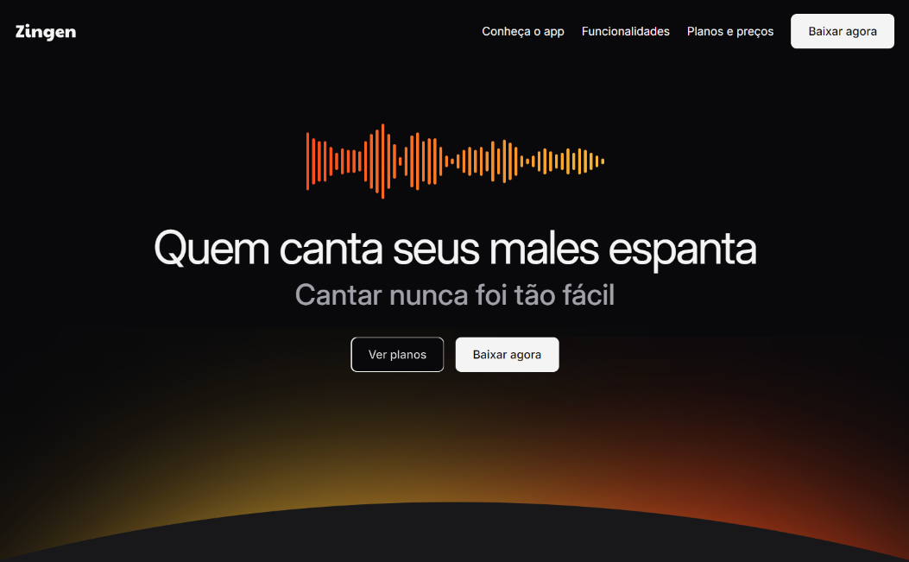

<h1> 🚀 Projeto prático - Landing Page - Zingen</h1>

  

## 🚀 Tecnologias

Esse projeto foi desenvolvido com as seguintes tecnologias:

- HTML e CSS
- Git e Github
- Figma

## 💻 Projeto

Página web responsiva de um produto fictício.
Este projeto foi realizado no curso de Fullstack da Rocketseat como desafio do módulo de responsividade.
